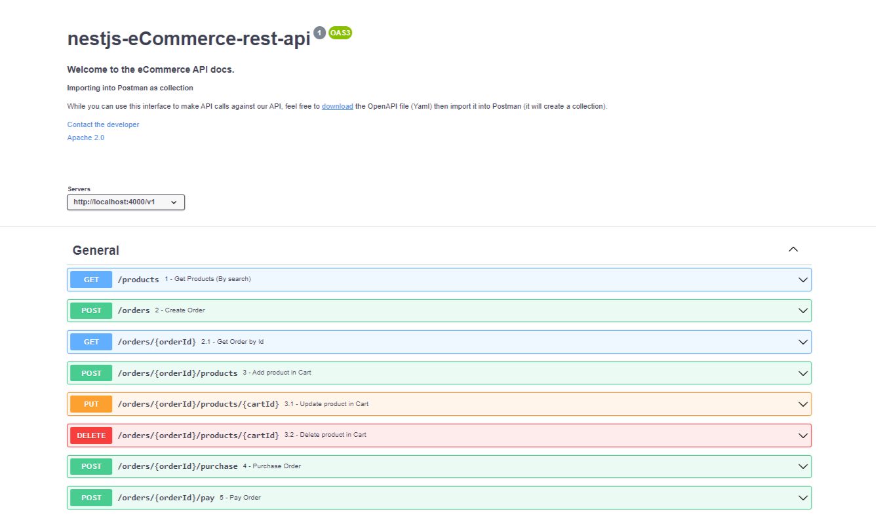

# eCommerce APi

## Description

Online shop API with the following features:
- Product API:
  - API to list all the products with      - Step 1
    - search: by title and description     - Step 1.1
    - sort: by price                       - Step 1.1

- Checkout API:
  - API to create an order                 - Step 2
    - API to view single order             - Step 2.1
  - API to add product in order            - Step 3
  - API to update/delete product in order  - Step 3.1
  - API to purchase order                  - Step 4
  - API to pay order                       - Step 5



### Built With

- [Nest.js](https://nestjs.com/)
- [Prisma](https://prisma.io/)


<!-- GETTING STARTED -->

## Getting Started

To get a local copy up and running, please follow these simple steps.

### Prerequisites

Here is what you need to be able to run Cal.

- Node.js (Version: >=16.x <17)
- PostgreSQL
- Yarn _(recommended)_

## Development

### Setup

1. Clone the repo

   ```sh
   git clone https://github.com/mabc224/myos-test.git
   ```

2. Go to the project folder

   ```sh
   cd myos-test
   ```

3. Install packages with yarn

   ```sh
   yarn
   ```

4. Set up your .env file
    
   ```sh
    Duplicate `.env.example` to `.env`
   
    Configure environment variables in the `.env` file.
   ```

5. Run migration

   ```sh
    yarn migrate:dev
   ```
6. Run 

    ```bash
    # development
    $ yarn start
    
    # watch mode
    $ yarn start:dev
    ```
   
7. Visit `localhost:<port>/v1/products` in your browser.


## API Documentation

Import open api docs into postman as collection.

```shell
  docs/api-v1.yaml (For Swagger)
  docs/eCommerece-Api.postman_collection.json (For Postman)
```

## Stay in touch

- Author - [Arsalan Bilal](https://www.linkedin.com/in/charsalanbilal)

## License

This app is [MIT licensed](LICENSE).
